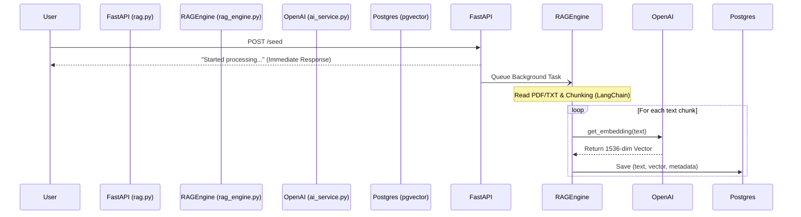
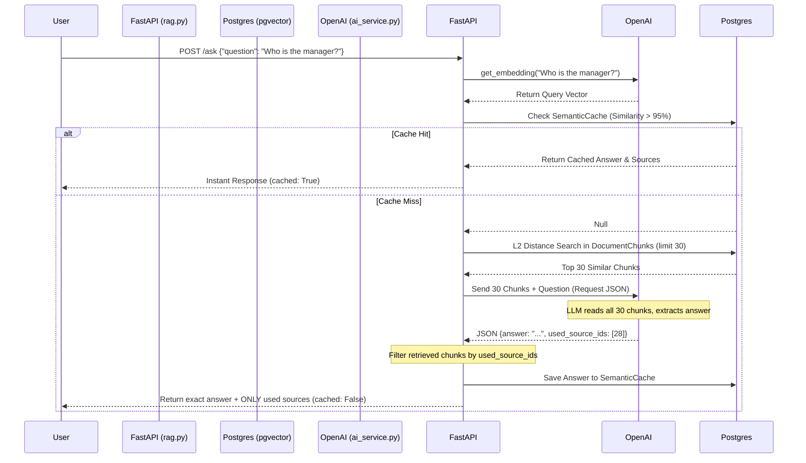

# Architecture & Project Structure

This document outlines the high-level architecture, data flows, and the Single Responsibility Principle (SRP) applied to the codebase.

## 📁 Directory Structure

The project strictly separates concerns. Each file has exactly one responsibility:

```text
rag_support_api/
├── alembic/            # Database migration scripts (auto-generated versions).
├── app/
│   ├── config.py       # Centralized config (Pydantic BaseSettings) & Logger setup.
│   ├── database.py     # Async SQLAlchemy engine (asyncpg) and session management.
│   ├── models.py       # SQLAlchemy ORM models (DocumentChunk and SemanticCache).
│   ├── repository.py   # Database abstraction layer (async CRUD and Cache operations).
│   ├── ai_service.py   # AsyncOpenAI client wrappers with Tenacity retry logic.
│   ├── rag_engine.py   # Core RAG logic: parsing PDFs/TXTs, chunking, orchestrating search.
│   ├── routers/
│   │   └── rag.py      # APIRouter containing the /seed and /ask REST endpoints.
│   └── main.py         # App lifecycle (lifespan), Observability Middleware, and router inclusion.
├── tests/
│   └── test_main.py    # Pytest asynchronous API tests using httpx.
├── test_documents/     # Directory for dropping PDF/TXT files to be seeded.
├── docker-compose.yml  # Infrastructure definition (PostgreSQL + pgvector + API).
├── Dockerfile          # Container build instructions (uses Gunicorn for production).
└── requirements.txt    # Python dependencies.
```

---

## 🔄 Data Flows (Mermaid Diagrams)

### 1. Document Ingestion Flow (`POST /seed`)
Runs asynchronously via FastAPI `BackgroundTasks` to avoid blocking the API.



### 2. Retrieval-Augmented Generation Flow (`POST /ask`)
Uses LLM-based Citation to filter mathematical noise and return only accurate sources.


